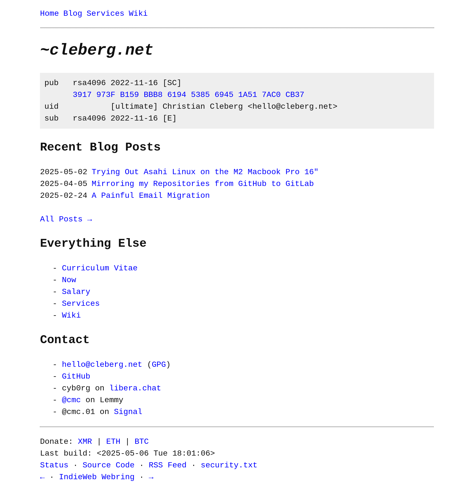

# Table of Contents

1.  [cleberg.net](#org7e6a5fc)
    1.  [Site Structure](#orgdb622a7)
    2.  [Dependencies](#org4029d4c)
    3.  [Viewing the Site Examples](#orgd805aba)
    4.  [Configuration](#orgc1b1a3d)
    5.  [Setup Instructions](#org16caf48)
    6.  [Building and Publishing the Site](#org507540e)
    7.  [Creating New Blog Posts](#org99866ce)
    8.  [Contributing and Issue Tracking](#org57a6a9c)

# cleberg.net

This document describes the structure and usage of the `cleberg.net` project.
The site is built and maintained using the Org-Mode publishing system within
Emacs, supported by the weblorg package. This setup allows for generation of
static HTML content from Org files using a declarative configuration.

## Site Structure

The project source files are written in Org-Mode format and reside in the
repository. These files are processed by the publishing engine to produce HTML
output, which can then be deployed to a web server.

The main site components are:

-   Org source files containing content, including blog posts and pages.
-   A configuration file (`publish.el`) that specifies publishing parameters like
    base URL, output directories, and export options.
-   Assets such as images and stylesheets, located in designated subdirectories.
-   Utility scripts (e.g., `build.sh`) to facilitate building and deployment.

## Dependencies

The publishing system depends on:

-   Emacs text editor with Org-Mode.
-   The weblorg package, available at <https://github.com/emacs-love/weblorg>, which
    provides advanced Org publishing functionality and theming support.

## Viewing the Site Examples

Screenshots illustrating the site in both light and dark display modes are
included in the `./screenshots/` directory.

<table border="2" cellspacing="0" cellpadding="6" rules="groups" frame="hsides">

<colgroup>
<col  class="org-left" />

<col  class="org-left" />
</colgroup>
<thead>
<tr>
<th scope="col" class="org-left">Light Mode</th>
<th scope="col" class="org-left">Dark Mode</th>
</tr>
</thead>
<tbody>
<tr>
<td class="org-left"></td>
<td class="org-left"></td>
</tr>
</tbody>
</table>

## Configuration

Custom site settings are centralized in the `publish.el` file. This file
establishes key variables such as:

-   The base URL for links.
-   Output directories.
-   Publishing rules defining which files are converted and how.
-   Theme settings managed by weblorg.

Users intending to modify site parameters should review and edit this file
accordingly. The weblorg documentation contains extensive details on
configuration options and expected formats.

## Setup Instructions

To obtain a working copy of this repository, execute the following commands
within a shell environment or Emacs&rsquo; shell interface:

    git clone https://github.com/ccleberg/cleberg.net
    cd cleberg.net
    emacs -nw

For users employing Doom Emacs, open any repository Org file using `SPC f f` to
access the content.

## Building and Publishing the Site

The publishing process involves invoking Emacs with the `publish.el` script,
which performs the export of Org documents to HTML output.

Configure the environment variable `ENV` as follows:

-   If `ENV` is set to `prod`, the script uses production base URL settings as
    defined in `publish.el`.
-   If `ENV` is unset or set differently, the script defaults to development
    settings, typically using `localhost:8000` as the base URL.

Example commands to build the site:

    # Production build:
    ENV=prod emacs --script publish.el
    
    # Development build:
    emacs --script publish.el

Generated site files reside in the designated output directory, ready for
deployment. Deployment can be performed by standard file transfer protocols such
as `scp` or SFTP.

The `./build.sh` script automates the build process. It can be executed with or
without the `ENV` variable to perform production or development builds
respectively.

    # Production build script:
    ENV=prod ./build.sh
    
    # Development build script:
    ./build.sh

## Creating New Blog Posts

To add new blog content, follow this procedure within Emacs:

1.  Open a new Org file (via `C-x C-f` or Doom&rsquo;s `SPC f f`).
2.  Insert the contents of the post template with `C-x i`, sourcing from
    `utils/template.org`.
3.  Modify the new file as needed to add post content and metadata.

This method streamlines content creation by reusing a preformatted template.

## Contributing and Issue Tracking

Contributions and bug reports are tracked through the repository&rsquo;s issue tab on
GitHub. Users are encouraged to submit reports, feature requests, or pull
requests following standard repository guidelines.

For further details on the usage of Org-Mode, weblorg configuration, or
publishing workflows, consult the respective documentation sources.

